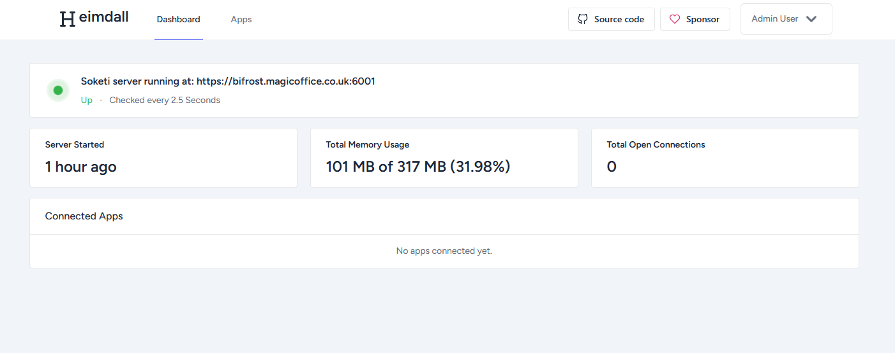
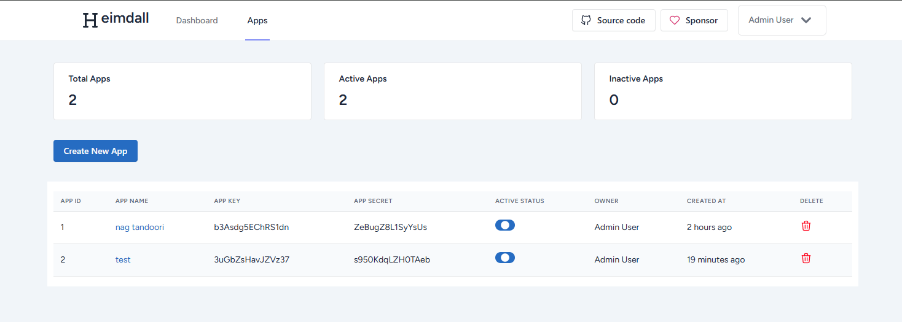
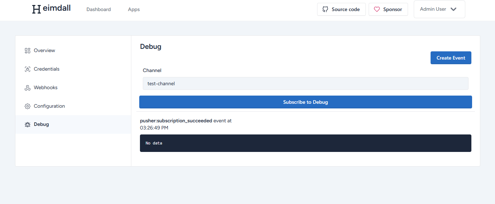
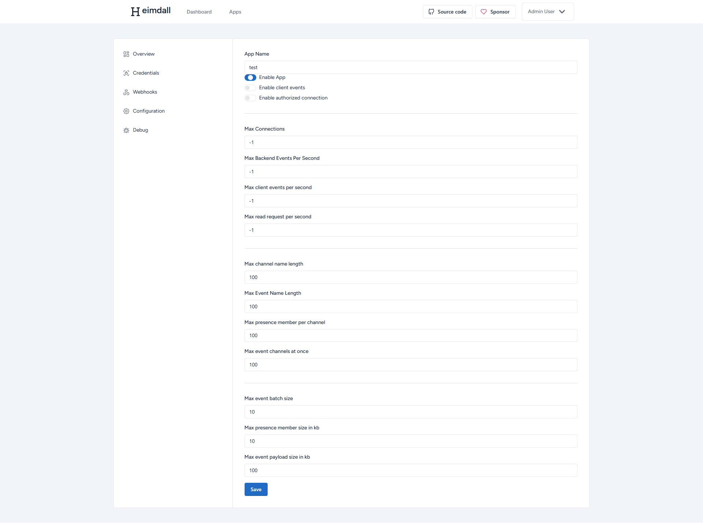

# Heimdall: A powerful dashboard for Soketi
## ScreenShots
### Dashboard

### List All Apps

### Debugging

### Single App Configuration

### Event Creation


## Project Overview

This project is a powerful dashboard for Soketi.
It is built with Laravel and Livewire. One step complete solution for your soketi server with build in features like:

- [x] App Mangement
- [x] Webhook Management
- [x] App configuration
- [x] Database Driver
- [x] Debugger

## Table of Contents

- [A powerful dashboard for Soketi](#a-powerful-dashboard-for-soketi)
    - [ScreenShots](#screenshots)
        - [Dashboard for All App](#dashboard-for-all-app)
        - [Single app configuration](#single-app-configuration)
        - [Credentails Page](#credentails-page)
    - [Project Overview](#project-overview)
    - [Table of Contents](#table-of-contents)
    - [Installation](#installation)
    - [Getting Started](#getting-started)
    - [Testing](#testing)
    - [Contributing](#contributing)
    - [License](#license)

## Installation

## Docker
 download the docker-compose.yml file and run the following command
```bash
docker-compose up
```

## Open heimdall container and run the following commands
```bash
php artisan migrate --seed
```

## Follow these steps to set up the project locally:

1. Clone the repository:

```bash
git clone https://github.com/imerfanahmed/Heimdall.git
```


2. Navigate to the project directory:

```bash
cd Heimdall
```

3. Install dependencies:

```bash
composer install
npm install
```

4. Copy the environment file:

```bash
cp .env.example .env
```

5. Generate the application key:

```bash
php artisan key:generate
```
6. Compile the assets:

```bash
npm run build
```

7. Configure the database in the `.env` file.

8. Run migrations and seed the database:

```bash
php artisan migrate --seed
```

9. Install Soketi Server Globally
    1. The following example works for Ubuntu. For other distributions, consider using the equivalents.
    ``` bash
    apt install -y git python3 gcc build-essential
    ```
    2. Node.js LTS (14.x, 16.x, so on) is required due to uWebSockets.js build limitations. You can install it using the following commands:
    ``` bash
    npm install -g @soketi/soketi
    ```

## Getting Started

First Start the soketi server within the folder as .env consists of the configuration for soketi


```bash
soketi start
```

To start the Dashboard server, run the following command:

```bash
php artisan serve
```

Visit [http://localhost:8000](http://localhost:8000) in your browser to view the application.

**_NOTE:_**  If you find difficulties and want me to setup for you, you can directly email me at erfan.siam98@gmail.com

## Testing

To run tests, use the following command:

```bash
php artisan test
```

The application uses PHPUnit for testing.

## Contributing

If you would like to contribute to the project, please follow the [contribution guidelines](CONTRIBUTING.md).

## License

This project is open-source and available under the [MIT License](LICENSE). Feel free to use, modify, and distribute the code as needed.

Happy coding!
